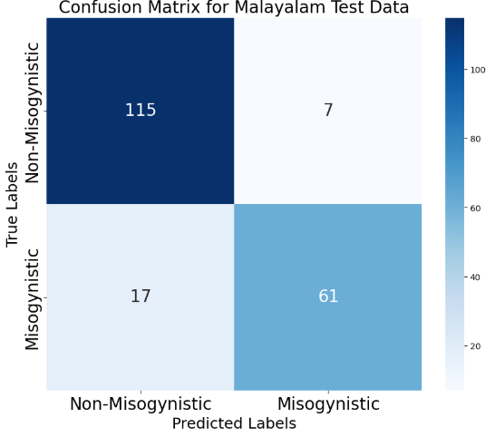

# HerWILL@DravidianLangTech 2025: Ensemble Approach for Misogyny Detection in Memes Using Pre-trained Text and Vision Transformers
- **Authors:** Neelima Monjusha Preeti, Trina Chakraborty, Noor Mairukh Khan Arnob, Saiyara Mahmud, Azmine Toushik Wasi
- **Accepted** at the NAACL 2025 Workshop DravidianLangTech!
- Give our paper a read [here](https://aclanthology.org/2025.dravidianlangtech-1.63/)
- We achieved 2nd place at the misogynistic meme detection competition. [Competition page](https://codalab.lisn.upsaclay.fr/competitions/20856)
<p align="center">
  
</p>

**Abstract** Misogynistic memes on social media perpetuate gender stereotypes, contribute to harassment, and suppress feminist activism. However, most existing misogyny detection models focus on high-resource languages, leaving a gap in low-resource settings. This work addresses that gap by focusing on misogynistic memes in Tamil and Malayalam, two Dravidian languages with limited resources. We combine computer vision and natural language processing for multi-modal detection, using CLIP embeddings for the vision component and BERT models trained on code-mixed hate speech datasets for the text component. Our results show that this integrated approach effectively captures the unique characteristics of misogynistic memes in these languages, achieving competitive performance with a Macro F1 Score of 0.7800 for the Tamil test set and 0.8748 for the Malayalam test set. These findings highlight the potential of multimodal models and the adaptation of pre-trained models to specific linguistic and cultural contexts, advancing misogyny detection in low-resource settings. Code available at https://github.com/HerWILL-Inc/NAACL-2025

# Experimental Results for Malayalam
| **Language Model** | **Vision Model** | **F1 Score** | **Accuracy** |
|----------|----------|----------|----------|
| ai4bharat/IndicBERTv2-MLM-only  | openai/clip-vit-base-patch32   | 0.8753   | 0.8812    |
| PosteriorAI/dravida_llama2_7b  | zer0int/CLIP-GmP-ViT-L-14  | 0.8896   | 0.8938  |
|./malayalam-codemixed-abusive-MuRIL   | openai/clip-vit-base-patch32 | **0.8940**  | **0.9000**  |

# Experimental Results for Tamil
| **Language Model** | **Vision Model** | **F1 Score** | **Accuracy** |
|----------|----------|----------|----------|
| ai4bharat/IndicBERTv2-MLM-only  | openai/clip-vit-base-patch32   | 0.7643   | **0.8455**    |
| PosteriorAI/dravida_llama2_7b  | zer0int/CLIP-GmP-ViT-L-14  | **0.7800**   | 0.8427  |
|./tamil-codemixed-abusive-MuRIL   | openai/clip-vit-base-patch32 | 0.7575  | 0.8174  |
## Error Analysis for Malayalam
<p align="center">
  
</p>

## Citation
If you use our code or ideas from our paper in your work, please cite our paper.

```
@inproceedings{preeti2025herwill,
  title={HerWILL@ DravidianLangTech 2025: Ensemble Approach for Misogyny Detection in Memes Using Pre-trained Text and Vision Transformers},
  author={Preeti, Neelima Monjusha and Chakraborty, Trina and Arnob, Noor Mairukh Khan and Mahmud, Saiyara and Wasi, Azmine Toushik},
  booktitle={Proceedings of the Fifth Workshop on Speech, Vision, and Language Technologies for Dravidian Languages},
  pages={355--360},
  year={2025}
}
```
